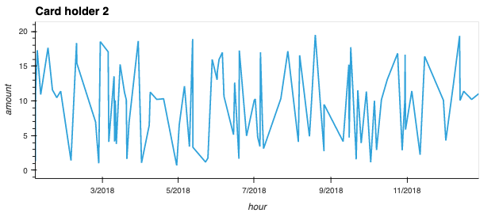
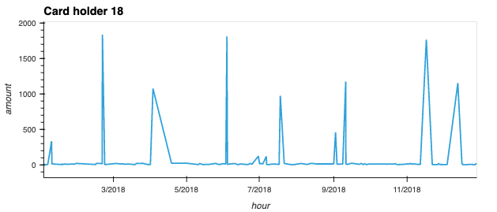
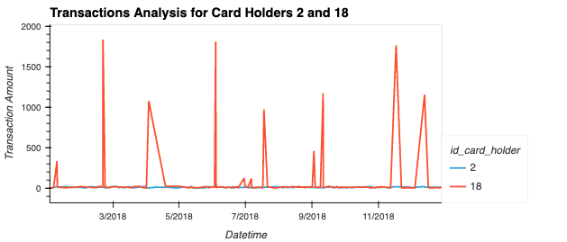
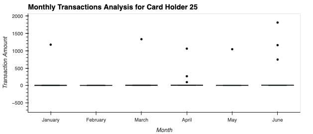

# Fraud Detection using SQL and PyViz

## Overview
This repository contains the code and analysis for a fraud detection assignment that involves analyzing historical credit card transactions and consumption patterns. The assignment is divided into three main tasks:

  1. Data Modeling
  2. Data Engineering
  3. Data Analysis

## Data Modeling

In this section, we define a database model to store credit card transactions data and create a new PostgreSQL database using this model. We also create an entity-relationship diagram (ERD) based on the provided CSV files to visualize the structure of our database.

### Entity-Relationship Diagram (ERD)
![ERD Diagram](
The project utilized a provided database containing credit card transaction data. The database included information about cardholders, merchants, transaction amounts, and timestamps.

## Objectives
The primary objectives of the project were as follows:
1. Isolate and group transactions for each cardholder.
2. Identify transactions with amounts less than $2.00 per cardholder.
3. Detect evidence of credit card hacking or fraudulent transactions.
4. Analyze the top 100 highest transactions within specific time frames.
5. Explore consumption patterns for different cardholders and identify anomalies.
6. Utilize visualizations to enhance fraud detection insights.

## Methodology

### Transactions Isolation and Grouping
To isolate transactions for each cardholder, a SQL view named "TransactionsperCardHolderID" was created. This allowed for an organized breakdown of transactions for individual cardholders, considering that a cardholder could have multiple cards.

### Detection of Small Transactions
A SQL view named "LessThan2DollarTransactionsPerCardHolderID$2" was established to count transactions with amounts less than $2.00 per cardholder. This view facilitated the identification of potentially suspicious activities involving small transactions.

### Evidence of Credit Card Hacking
Evidence of credit card hacking was assessed by examining transactions with amounts less than $2.00. These transactions, constituting around 10% of the dataset, were analyzed for irregular patterns. Notably, certain cardholders exhibited a higher frequency of such transactions, suggesting potential fraud.

### Analysis of Top Transactions
A SQL view named "top100" was utilized to identify the top 100 highest transactions made between 7:00 am and 9:00 am. This analysis aimed to detect any anomalous transactions that could indicate fraudulent activities during this time frame.

### Consumption Patterns and Anomaly Detection
PyViz visualizations were employed to create time series line plots of transactions for cardholders. A clear difference in consumption patterns between cardholders was observed. Cardholder 18 exhibited higher spending limits, potentially making them susceptible to larger-scale fraud attempts.

### Outlier Detection
Box plots were utilized to analyze expenditure data from January 2018 to June 2018 for cardholder ID 25. Outliers were identified in months with transactions deviating from the typical spending behavior, suggesting potential anomalies.

## Conclusion
The project successfully demonstrated the utilization of SQL querying and PyViz visualizations for credit card fraud detection. Various analysis techniques were applied to isolate potential fraudulent transactions, identify anomalous patterns, and assess consumption behaviors. The findings underscored the importance of closely monitoring small transactions, analyzing consumption patterns, and employing data visualization tools for fraud detection.

The project enhanced skills in data analysis, SQL querying, data visualization, and fraud detection techniques. It also improved communication abilities for presenting complex findings in a comprehensible manner.

For more detailed information, refer to the provided code, SQL views, and PyViz visualizations in the respective files.

---
**Author:** Moh Jaiswal  
**Date:** [23/08/23]
