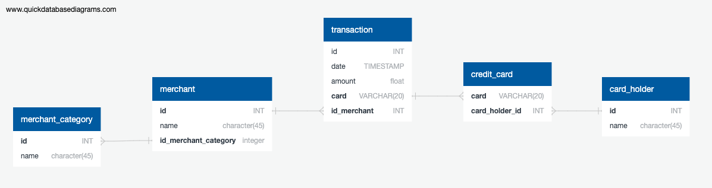

# CrediSafe - Credit Card Fraud Detection

## Description

CrediSafe is a credit card fraud detection project that analyzes historical credit card transactions and consumption patterns. The project comprises three main tasks:

1. **Data Modeling:** We define a database model to store credit card transaction data and create a PostgreSQL database using this model. Additionally, an entity-relationship diagram (ERD) visualizes the database structure.

2. **Data Engineering:** We create a database schema in PostgreSQL, populate it with data from CSV files, and perform data engineering.

3. **Data Analysis:** Addressing the CFO's request, we identify potential fraudulent transactions and generate detailed trend data on specific cardholders. This analysis involves SQL queries and PyViz visualizations.

## Badges

## Visuals

### Entity-Relationship Diagram (ERD)

The ERD displays relationships between different tables, including `card_holder`, `credit_card`, `merchant`, `merchant_category`, and `transaction`.

## Installation

To set up and run CrediSafe, follow these steps:

1. Clone the repository to your local machine.
2. Set up a PostgreSQL database called CrediSafe.
3. Create the database schema using the provided SQL file: `psql -d CrediSafe -a -f Schema_MJ.sql`.
4. Import data from the CSV files into the database.
5. Install the required Python libraries: `pip install pandas sqlalchemy hvplot`.
6. Run the Jupyter Notebook for data analysis: `visual_data_analysis_MJ.ipynb`.

### Requirements

- PostgreSQL database
- Python (Ver 3.3.2 preferred)
- Pandas
- SQLAlchemy
- hvPlot

## Objectives

The primary objectives of the project are:

1. Isolate and group transactions for each cardholder.
2. Identify transactions with amounts less than $2.00 per cardholder.
3. Detect evidence of credit card hacking or fraudulent transactions.
4. Analyze the top 100 highest transactions within specific time frames.
5. Explore consumption patterns for different cardholders and identify anomalies.
6. Utilize visualizations to enhance fraud detection insights.

## Usage

Use the Jupyter Notebook `visual_data_analysis_MJ.ipynb` to perform data analysis and generate reports. Follow the notebook's instructions for querying the database and creating visualizations.

## Visual Data Analysis of Fraudulent Transactions

For a detailed visual analysis of fraudulent transactions and trends, you can use the provided Jupyter Notebook. The notebook covers the following aspects:

### Data Analysis Question 1

The notebook explores potential fraudulent transactions for two cardholders, cardholder IDs 2 and 18. It visualizes the time series of transactions over the course of the year for each cardholder separately and compares their consumption patterns. Any notable differences and observations are discussed in the notebook.

### Data Analysis Question 2

In response to the CEO's concern, the notebook analyzes expenditure data for cardholder ID 25 in the first quarter of 2018. It creates box plots to represent expenditure data and identifies any outliers. The notebook provides insights into anomalies and conclusions.

To run the notebook, ensure you have the required dependencies installed and follow the instructions in the notebook for data analysis and visualization.

Feel free to explore the notebook to gain a deeper understanding of the data analysis conducted in this project.

### Dive Deeper: Transactions Isolation and Grouping

- To isolate transactions for each cardholder, a SQL view named "TransactionsperCardHolderID" was created, allowing for an organized breakdown of transactions.
- A SQL view named "LessThan2DollarTransactionsPerCardHolderID$2" was established to count transactions with amounts less than $2.00 per cardholder, facilitating the identification of potentially suspicious activities.
- Evidence of credit card hacking was assessed by examining transactions with amounts less than $2.00, suggesting potential fraud.
- A SQL view named "top100" was utilized to identify the top 100 highest transactions made between 7:00 am and 9:00 am, aiming to detect anomalous transactions.
- PyViz visualizations were employed to create time series line plots of transactions, highlighting differences in consumption patterns.

### Conclusion

The project successfully demonstrated the utilization of SQL querying and PyViz visualizations for credit card fraud detection. Various analysis techniques were applied to isolate potential fraudulent transactions, identify anomalous patterns, and assess consumption behaviors. The findings underscore the importance of closely monitoring small transactions, analyzing consumption patterns, and employing data visualization tools for fraud detection.

The project enhanced skills in data analysis, SQL querying, data visualization, and fraud detection techniques, and it improved communication abilities for presenting complex findings in a comprehensible manner.

For more detailed information, refer to the provided code, SQL views, and PyViz visualizations in the respective files.

## Support

If you need help or have questions, you can:

- Create an issue in this repository.
- Chat with me on [LinkedIn](https://www.linkedin.com/in/mohjaiswal).
- Contact me at mohjaiswal@gmail.com.

## Roadmap

The project roadmap includes the following:

1. Improve fraud detection algorithms.
2. Enhance visualizations for better insights.
3. Explore machine learning-based fraud detection.

## Contributing

Any and all contributions are welcome to this project. If you want to contribute, please follow these steps:

1. Fork the repository.
2. Create a new branch for your feature: `git checkout -b feature-name`.
3. Make your changes and commit them.
4. Push the branch to your fork: `git push origin feature-name`.
5. Open a pull request to this repository.

## Authors and Acknowledgment

- **Moh Jaiswal** (Project Lead)

I would like to acknowledge the support of my instructors Sasanka Panda and Mehdi Lebi and fellow students who provided valuable insights during this project.

## License

This project is licensed under the MIT License - see the [LICENSE.md](LICENSE.md) file for details.

## Project Status

Development is currently active, and I am open to contributions from the community. Feel free to get involved and help me improve credit card fraud detection.

---

**Moh**
**[01/11/23]**
